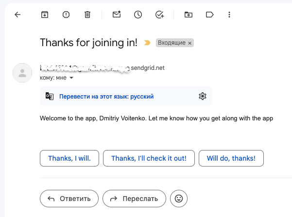

## Intro to NODE.JS MongoDB Task Manager API
Welcome to the Task Manager API and fell free to play around.

## Prerequisite
- Install Docker Engine - [documentation](https://docs.docker.com/engine/install/)
- Run MongoDB locally or extract from atlassian for connection and collection propagation.

## Commands
Instructions to run CURL commands. From the list commands you are able to run following main and <u>others</u>.

- `curl -X POST -H 'content-type: application/json' --data '{"email":"test@gmail.com","name":"vodis","password":1234567}' http://localhost:4000/users`
  - Will create new user in MongoDB and send invitation by email.


- `curl -X POST -H 'content-type: application/json' -H 'Authorization: Bearer YOUR_TOKEN_HERE' --data '{"email":"test@gmail.com","password":"1234567"}' http://localhost:4000/users/login`
  - Will login a user and create new authorization token.


- `curl -X GET -H 'Authorization: Bearer YOUR_TOKEN_HERE' http://localhost:4000/users/me`
  - Will return user information, like this:
    ```json
    {"_id":"65d93dcda2345aea5beb96fd","name":"vodis","email":"test@gmail.com","age":0,"createdAt":"2024-02-24T00:52:29.259Z","updatedAt":"2024-02-24T01:16:21.755Z","__v":4}
    ```

Or you can use any REST client suitable for same purpose.


## Where can I get sendgrid Api key?

You have to get registered and spend a bit time reading [documentation](https://docs.sendgrid.com/)

And you are done! Feel free to play with email notifications.


